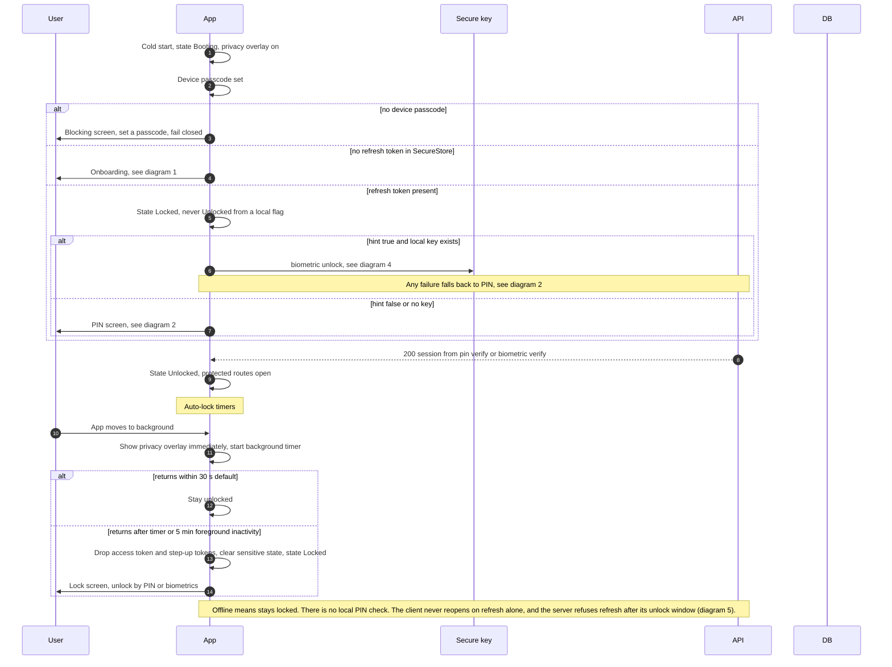

# 9. App launch decision and auto-lock

← [8. Disable biometrics and revoke device](./08-disable-biometrics-revoke-device.md) · [Index](./README.md)

```mermaid
sequenceDiagram
    autonumber
    participant U as User
    participant A as App
    participant K as Secure key
    participant S as API
    participant D as DB
    A->>A: Cold start, state Booting, privacy overlay on
    A->>A: Device passcode set
    alt no device passcode
        A->>U: Blocking screen, set a passcode, fail closed
    else no refresh token in SecureStore
        A->>U: Onboarding, see diagram 1
    else refresh token present
        A->>A: State Locked, never Unlocked from a local flag
        alt hint true and local key exists
            A->>K: biometric unlock, see diagram 4
            Note over A,S: Any failure falls back to PIN, see diagram 2
        else hint false or no key
            A->>U: PIN screen, see diagram 2
        end
    end
    S-->>A: 200 session from pin verify or biometric verify
    A->>A: State Unlocked, protected routes open
    Note over A: Auto-lock timers
    U->>A: App moves to background
    A->>A: Show privacy overlay immediately, start background timer
    alt returns within 30 s default
        A->>A: Stay unlocked
    else returns after timer or 5 min foreground inactivity
        A->>A: Drop access token and step-up tokens, clear sensitive state, state Locked
        A->>U: Lock screen, unlock by PIN or biometrics
    end
    Note over A,S: Offline means stays locked. There is no local PIN check. The client never reopens on refresh alone, and the server refuses refresh after its unlock window (diagram 5).
```
SEC: 013, 019, 033, 034, 050, 051, 054.
